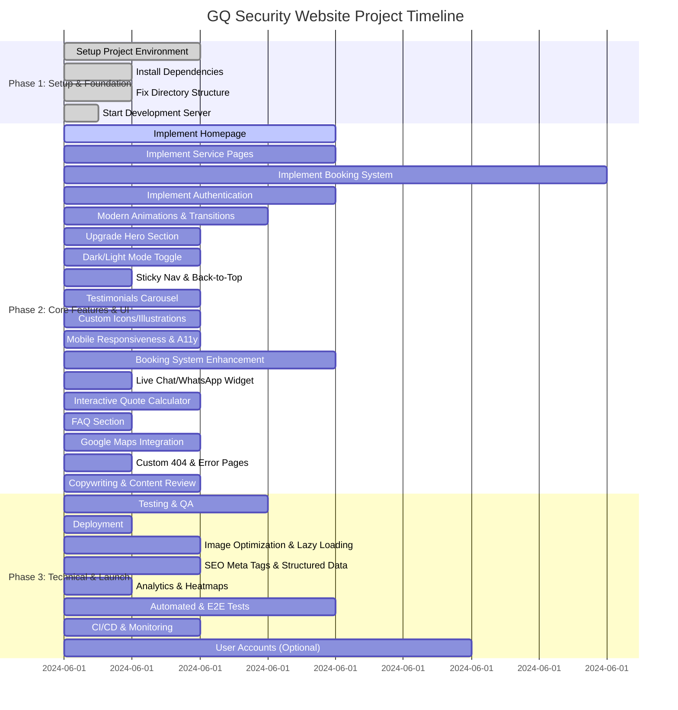

# TaskMaster AI Project Plan

## 📋 Project Overview
A modern, professional security services website with advanced UI/UX, robust booking, and best-in-class technical features.

---

## 🎯 Project Phases & Gantt Chart

---

## 🗂️ Compact Task Table

| ID   | Title                                 | Status | Priority | Dependencies | Complexity | Estimate | Phase | Description |
|------|---------------------------------------|--------|----------|--------------|------------|----------|-------|-------------|
| T001 | Setup Project Env.                    | ✅     | Critical | None         | Simple     | 2h       | 1     | Init repo, Node.js, config |
| T002 | Install Deps                          | ✅     | Critical | T001         | Simple     | 1h       | 1     | Next.js, Tailwind, Lucide |
| T003 | Fix Dir. Structure                    | ✅     | Critical | T001         | Simple     | 1h       | 1     | Organize files/folders |
| T004 | Start Dev Server                      | ✅     | Critical | T002,T003    | Simple     | 0.5h     | 1     | Run dev, verify setup |
| T005 | Implement Homepage                    | 🔄     | High     | T004         | Medium     | 4h       | 2     | Hero, intro, services, CTA |
| T006 | Implement Service Pages               | 📝     | High     | T005         | Medium     | 4h       | 2     | Close Protection, Hire, etc. |
| T007 | Implement Booking System              | 📝     | High     | T005         | Complex    | 8h       | 2     | Booking form, quote calc. |
| T008 | Implement Auth                        | 📝     | Medium   | T005         | Medium     | 4h       | 2     | Login/signup, secure routes |
| T009 | Testing & QA                          | 📝     | High     | T005-T008    | Medium     | 3h       | 3     | Manual & auto tests |
| T010 | Deployment                            | 📝     | High     | T009         | Simple     | 1h       | 3     | Deploy, domain setup |
| T011 | Animations & Transitions              | 📝     | High     | T005         | Medium     | 3h       | 2     | Animate sections, cards |
| T012 | Upgrade Hero Section                  | 📝     | High     | T005         | Medium     | 2h       | 2     | Video/gradient, polish hero |
| T013 | Dark/Light Mode Toggle                | 📝     | Medium   | T005         | Medium     | 2h       | 2     | Theme switcher |
| T014 | Sticky Nav & Back-to-Top              | 📝     | Medium   | T005         | Simple     | 1h       | 2     | Sticky nav, back-to-top btn |
| T015 | Testimonials Carousel                 | 📝     | Medium   | T005         | Medium     | 2h       | 2     | Auto/fade testimonials |
| T016 | Custom Icons/Illustrations            | 📝     | Medium   | T006         | Medium     | 2h       | 2     | SVGs for each service |
| T017 | Mobile Responsive & A11y              | 📝     | High     | T005         | Medium     | 2h       | 2     | Responsive, ARIA, contrast |
| T018 | Booking System Enhancement            | 📝     | High     | T007         | Complex    | 4h       | 2     | Calendar, availability |
| T019 | Live Chat/WhatsApp Widget             | 📝     | Medium   | T005         | Simple     | 1h       | 2     | Chat widget for support |
| T020 | Interactive Quote Calculator          | 📝     | High     | T007         | Medium     | 2h       | 2     | Dynamic price, feedback |
| T021 | FAQ Section                           | 📝     | Medium   | T005         | Simple     | 1h       | 2     | Collapsible Q&A |
| T022 | Google Maps Integration               | 📝     | Medium   | T005         | Medium     | 2h       | 2     | Map for service area |
| T023 | Image Opt. & Lazy Loading             | 📝     | High     | T005         | Medium     | 2h       | 3     | Next.js Image, compress |
| T024 | SEO Meta & Structured Data            | 📝     | High     | T005         | Medium     | 2h       | 3     | Meta tags, Open Graph |
| T025 | Analytics & Heatmaps                  | 📝     | Medium   | T005         | Simple     | 1h       | 3     | Google Analytics, Hotjar |
| T026 | Automated & E2E Tests                 | 📝     | High     | T009         | Complex    | 4h       | 3     | Cypress/Playwright |
| T027 | CI/CD & Monitoring                    | 📝     | High     | T010         | Medium     | 2h       | 3     | GitHub Actions, uptime |
| T028 | Custom 404 & Error Pages              | 📝     | Medium   | T005         | Simple     | 1h       | 2     | Branded 404, error bounds |
| T029 | User Accounts (Optional)              | 📝     | Low      | T007         | Complex    | 6h       | 3     | User dashboard, history |
| T030 | Copywriting & Content Review          | 📝     | High     | T005         | Medium     | 2h       | 2     | Refine copy, trust signals |

---

**Legend:**
- Status: ✅=Done, 🔄=In Progress, 📝=Not Started
- Priority: Critical, High, Medium, Low
- Complexity: Simple, Medium, Complex
- Estimate: Time estimate
- Phase: Project phase